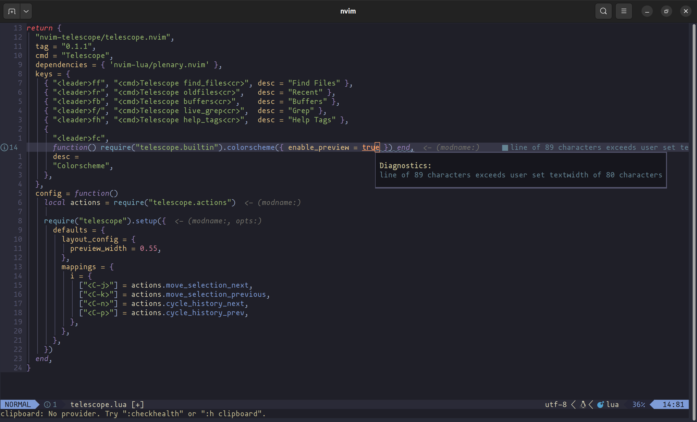

# textwidth-diagnostics.nvim

### Introduction

Very simple plugin to help you indicate whether the length of the lines of
your code uphold the textwidth. Sometimes you don't want to your line to be
wrapping or a vertical column to indicate the textwidth. For this reason I
made this plugin. By default it will be disabled, but when enabled it will use
the diagnostics-api of Neovim to give the user hints or info.



### Installation

**Lazy.nvim**
```
    {
        "MikkelvtK/textwidth-diagnostics.nvim",
        config = true,
    }
```

**Packer**
```
    use({
        "MikkelvtK/textwidth-diagnostics.nvim",
        config = function()
            require("textwidth-diagnostics").setup({})
        end,
    })
```

### Configuration


```
    options = {
        -- Severity will determine what diagnostic type will be shown. One of
        -- four values are available: ERROR, WARNING, HINT, INFO
        severity = "INFO",

        -- Textwidth will set when the diagnostic messages will popup. If left
        -- empty, it will take the textwidth set in the options of Neovim.
        textwidth = 80,
    }
```

### Usage

**Command**

`TextwidthDiagnosticsToggle` - toggle all the visibility of the diagnostics

**Example keymap**
```
    vim.keymap.set("n", "<leader>twt", "<cmd>TextwidthDiagnosticsToggle<cr>",
        { silent = true, noremap = true })
```
